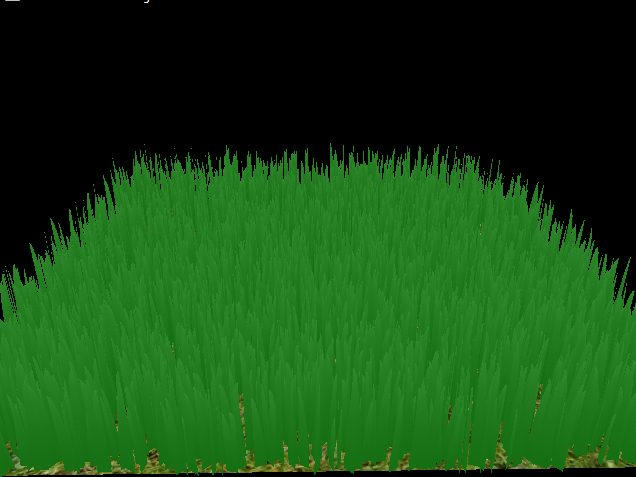
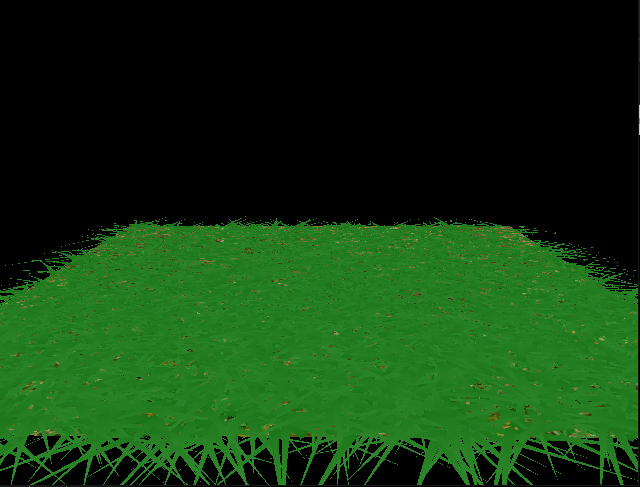
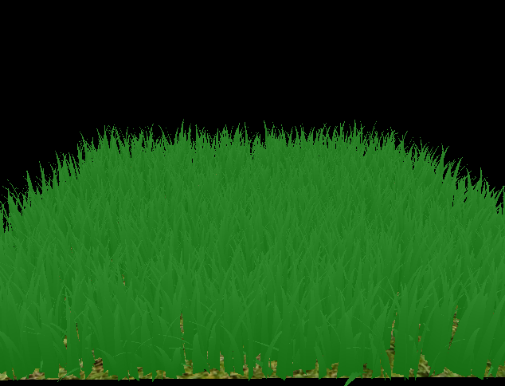
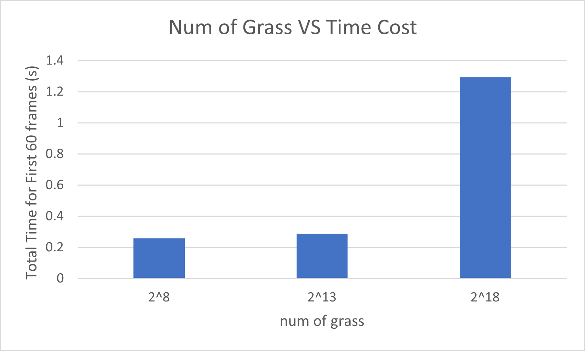

Vulkan Grass Rendering
==================================

**University of Pennsylvania, CIS 565: GPU Programming and Architecture, Project 5**

* Yichao Wang
  * [LinkedIn](https://www.linkedin.com/in/wangyic/) 
* Tested on: Windows 10 Home 64-bit (10.0, Build 18363)
  * Intel(R) Core(TM) i7-7700HQ CPU @ 2.80GHz (8 CPUs)
  * GeForce GTX 1060	6.1

### Description

This is a grass simulator and renderer with different forces and culling methods applied using [Responsive Real-Time Grass Rendering for General 3D Scenes](https://www.cg.tuwien.ac.at/research/publications/2017/JAHRMANN-2017-RRTG/JAHRMANN-2017-RRTG-draft.pdf).

### Physical Simulation

| No force | Gravity Force|
|----------|--------------|
| | |

| Gravity + Recovery | Gravity + Recovery + Wind |
|----------|--------------|
| | |

### Culling Tests

| Orientation culling | View-frustum culling | Distance culling |
|--|--|--|
|| | |

There are some blades that are not necessary to render at every frame so we perform some culling tests to remove them.

For orientation culling, we cull blades based on the cosine angle between its direction and the camera's direction.

For view-frustum culling, we cull blades if it is not within the camera's view-frustum.

For distance culling, we cull blades if it is too far from the camera's position.

### Performance Analysis

From above plot, we can see that render time increases as num of grass increases.

When the grass number is 2^18, we might not need to render all of them so we can perform some culling tests. Note that 2^18 grass takes average of 0.0178 seconds each frame. With orientation culling, it takes averaage of 0.0102 seconds each frame. With view-frustum culling and distance culling, render time decreases as we cull more and more grass.
