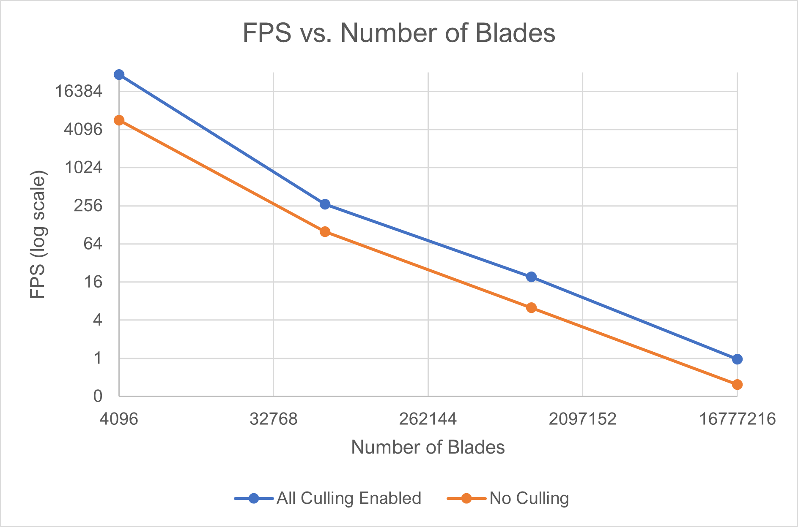
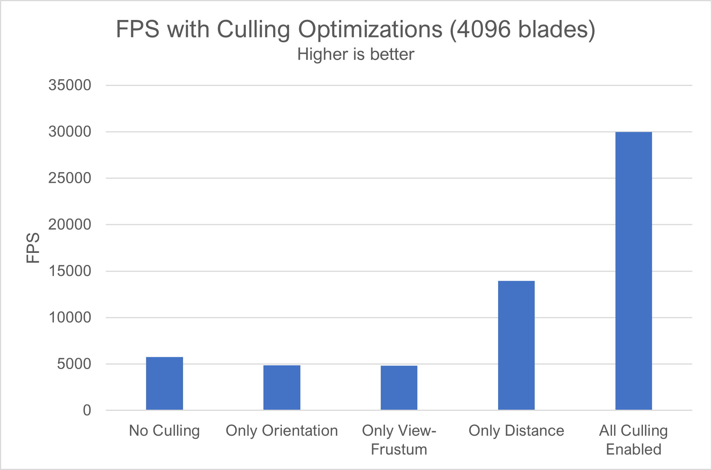
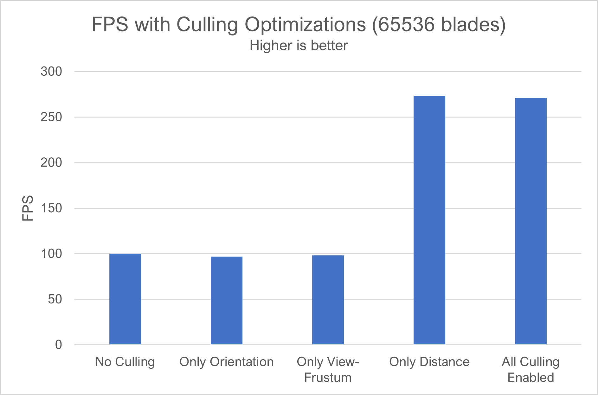
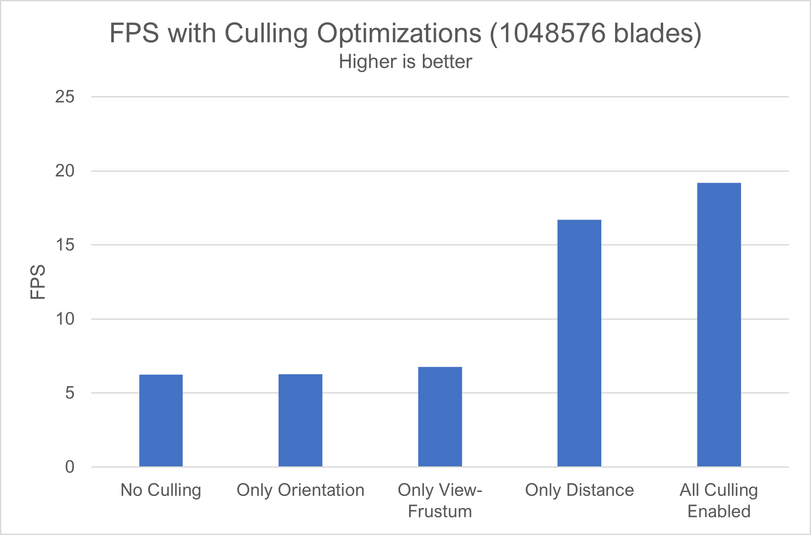
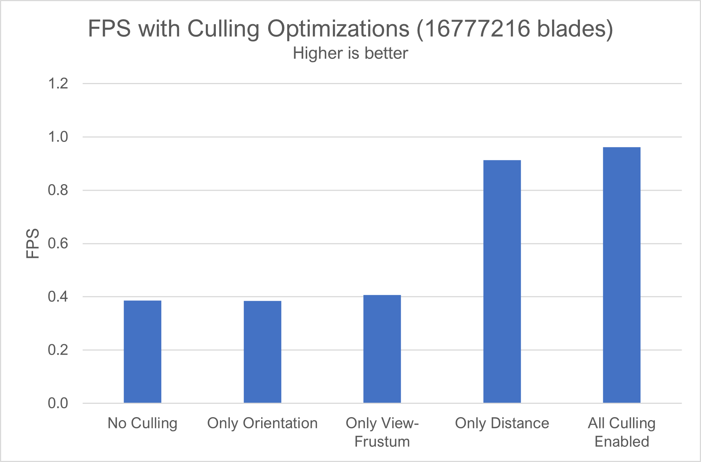

Vulkan Grass Rendering
==================================

**University of Pennsylvania, CIS 565: GPU Programming and Architecture, Project 5**

* Aditya Hota
  * [LinkedIn](https://www.linkedin.com/in/aditya-hota)
* Tested on: Windows 11, i7-8750H @ 2.20 GHz 20 GB, GTX 1070 8 GB

# Overview
https://user-images.githubusercontent.com/12516225/139997820-71cbc941-aba7-4718-bdbc-8f8757408048.mp4

This project involved implementing a grass rendered in Vulkan, based on the paper [Responsive Real-Time Grass Rendering for General 3D Scenes](https://www.cg.tuwien.ac.at/research/publications/2017/JAHRMANN-2017-RRTG/JAHRMANN-2017-RRTG-draft.pdf) by Jahrmann and Wimmer. There were three major components to this project, including rendering the grass, applying forces to control grass movement, and culling blades of grass to improve rendering frame rate when possible.

# Features
## Rendering and Compute Pipeline
To display blades of grass, the grass blades had to properly be transferred to the GPU. Part of this project involved adding the blades of grass to the models buffer so that the blades can be displayed along with the static image for the base. Vulkan is a new graphics API, so it took some getting used to before I could understand exactly what was going on. I first created a descriptor set for the grass, which populates the blade information into UBOs--these are eventually used for rendering.

Next, I had to make changes to the compute pipeline to pass in the data to the compute shaders. There are three buffers that are used and need space allocated for--these are the input blades, retained (called culled in the code) blades, and number of blades. The compute shader takes in input blades, computes any changes due to environmental forces, and performs culling to selectively render blades that will be perceived by the user. The selected blades are then passed onto the graphics pipeline, but all blades still have the impact of forces computed and their positions modified.

## Grass Blade Structure
A model for the grass blades was presented in the paper, which uses Bezier curves to represent the shape of a blade. Bezier curves are also used to represent grass blades for rendering in this project. The model is replicated below:

Each Bezier curve has three control points:
* `v0`: the position of the grass blade on the geomtry
* `v1`: a Bezier curve guide that is always "above" `v0` with respect to the grass blade's up vector
* `v2`: a physical guide for which we simulate forces on

Additional information is passed into the compute shader.
* `up`: the blade's up vector, which corresponds to the normal of the geometry that the grass blade resides on at `v0`
* Orientation: the orientation of the grass blade's face (as an angle offset from the x axis)
* Height: the height of the grass blade
* Width: the width of the grass blade's face
* Stiffness coefficient: the stiffness of our grass blade, which will affect the force computations on our blade

This data is cleverly packed into four `vec4`s, such that `v0.w` holds orientation, `v1.w` holds height, `v2.w` holds width, and `up.w` holds the stiffness coefficient.

# Modeling Forces
## Wind
A simple wind force was created, based on the cosine (along x) and sin (along z) of the current time. This makes the blades of grass move in a circular fashion.

## Gravity
Gravity drags down the tips of the blades, making them move towards the ground. Alone, gravity would cause all the grass to fall, so a counter force is needed to balance them. This is discussed next.

## Restorative
The restoring force pushes the blade of grass back up, allowing it to "bounce" back up when the wind and gravity push the blade down. Depending on the stiffness of the blade, the recovery can be slow or fast.

## Validation
Once all forces have been applied to the blade of grass, the end positions of the control points are validated. Specifically, we ensure that the wind and gravity do not push the blade of grass below the ground and that the blade of grass does not somehow end up being taller than its original height.

# Optimization
Three optimizations were added to increase the frame rate. Some were more effective than others, as discussed in the performance analysis section.

## Orientation Test
If the viewing angle is perpendicular to the thin edge of the blade of grass, it will not be rendered. It would not be visible to the user anyways, due to its thinness.

https://user-images.githubusercontent.com/12516225/139998042-966158d1-739e-409d-adf4-dbe54419e8be.mp4

## View-Frustum Culling
If a blade is out of the camera view, it will not be rendered. The algorithm used makes it a bit difficult to see the effect (which is a good thing, because we don't want to cull blades that we can see). I didn't directly use the algorithm in the paper; I had to turn off the check for culling in the z direction since it was causing blades to be culled when moving away from the grass patch--this should be the function of distance culling instead. For demo purposes, I have made the culling more extreme, as seen below.

https://user-images.githubusercontent.com/12516225/139998198-82aa14ca-c9c7-4f3f-9a75-83df591833f1.mp4

## Distance Culling
Distance culling only keeps blades that are within a certain distance to the camera. The maximum distance is divided into equally sized levels, where each level represents a radius away from the camera. Only some blades in each level are removed so that the effect looks more even.

https://user-images.githubusercontent.com/12516225/139998364-d1364819-6588-4683-af34-0bb173f33b4f.mp4

# Performance Analysis
All tests below were performed with the camera situated above the plane, at an angle. `r = 20.0, theta = 45.f, phi = -45.0`.
## Impact of Number of Blades
As expected, increasing the number of blades decreases the frame rate. This is because there are more blades to compute physics for, and more blades to send through the rendering pipeline. Adding more than 65536 blades causes us to not be able to see any of the blades anyways, so figures are only helpful in seeing the FPS hit. The graph below shows how the FPS decreases exponentially as number of blades is increased (a log2-log2 plot is used to more easily depict the changes in FPS, due to the large magnitude difference). Enabling all forms of culling gives us a nearly 4x boost in most cases!

  

## Effect of Each Optimization
It seems that distance culling had the greatest impact, and that orientation and view-frustum had about the same impact. I suspect that this is because distance culling removes the most number of blades (because it has a hard cutoff at a distance). Furthermore, we actually saw a performance hit when either orientation and view-frustum are used alone, probably due to the fact that additional computations need to be performed but only a few blades are culled. Of additional note is the fact that at higher blade numbers, distance culling seems to have a disproportionally greater impact on the FPS. I believe this is because the distance culling will take out the greatest number of blades, rather than a sparse sampling of them.

Separate graphs are used because increasing number of blades causex large differences in FPS magnitude which are hard to see on a single graph.

  

  

  

  

# References
* Getting camera eye from view matrix
  * Invert to find camera space in terms of world space and take displacement in fourth column of homogeneous matrix
  * https://www.3dgep.com/understanding-the-view-matrix/
