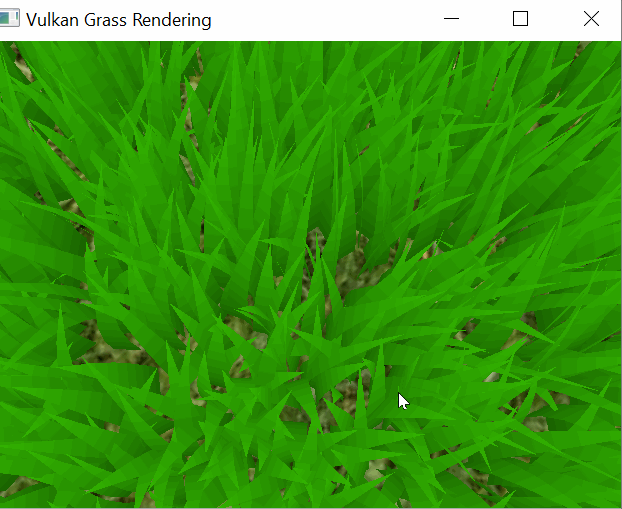
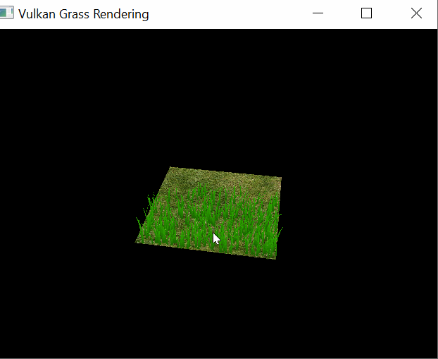
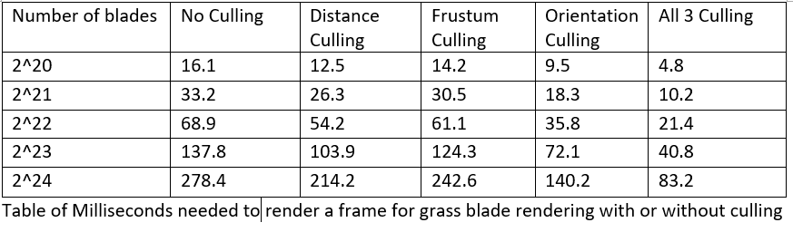
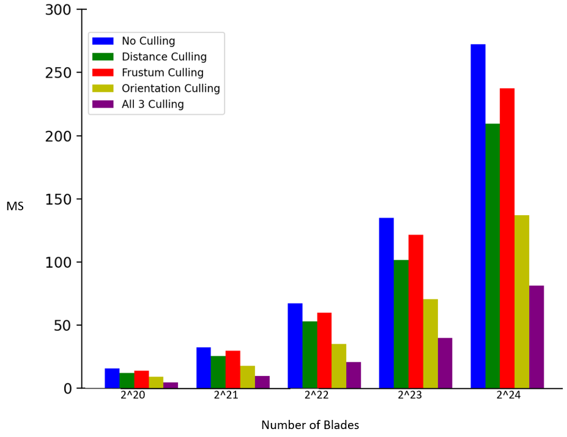

Vulkan Grass Rendering
==================================

**University of Pennsylvania, CIS 565: GPU Programming and Architecture, Project 5**

* Nuofan Xu
* Tested on: Windows 10, AMD Ryzen 3800X @ 32GB, RTX 2080 Super 

## OverView

This project implements a grass simulator and renderer using Vulkan. Each grass blade is represented by a quadratic Bezier curve, and physics calculations are performed on these control points in a computing shader. Rendering every grass blade in the scene is computationally expensive and not favorable - luckily grass blade that do not contribute to a frame can be culled in the shader. 

The rendering pipeline can be described as following:
- Visible bezier representaions of grass blades are sent to a grass graphics pipeline 
- The Bezier control points are transformed.
- The geometry is created in tesselation shaders
- The grass is shaded in the fragment shader. 

The project uses grass rendering techniques detailed in [Responsive Real-Time Grass Rendering for General 3D Scenes](https://www.cg.tuwien.ac.at/research/publications/2017/JAHRMANN-2017-RRTG/JAHRMANN-2017-RRTG-draft.pdf).

## Grass Simulation

To simulate an idyllic nature scene in a realistic fashion, besides detailed trees and bushes, as well as a complex water and sky dome simulation, we need a high-quality grass effect. We must be able to cover large areas of the terrain with it, without monopolizing the GPU. The grass should look naturally grown and should wave realistically in the wind. This imposes computational constraints and a balance between perfect quality and fast rendering need to be made.

Here we use  the following physics model. A grass blade is represented by a Bezier curve where the first control point is fixed on the plane, and the physics calculations are performed on the third control point. Along with the three control points, a blade is also defined by an up vector and scalar height, orientation, width, and stiffness coefficient.

All of the blade data is packed into 4 `vec4`s. The scalar values are packed into the fourth component of the control points and the up vector.  

| x | y | z | w |
| ---- | ---- | ---- | ----------- |
| v0.x | v0.y | v0.z | orientation |
| v1.x | v1.y | v1.z | height |
| v2.x | v2.y | v2.z | width |
| up.x | up.y | up.z | stiffness |

### Forces per Grass Blade

Forces are first applied to the `v2` control point. Potential errors are corrected in the state validation stage. The total force applied is the sum of the gravity, recovery, and wind forces.  

#### Gravity

Gravitational forces applied to each grass blade is a sum of the environmental gravity and the front gravity, which is the gravity with respect to the front facing direction of the blade - computed using the orientation. 

`environmentalGravity = normalize(D.xyz) * D.w`

`frontGravity = (0.25) * ||environmentalGravity|| * frontFacingDirection`

`g = environmentalGravity + frontGravity`

#### Recovery

The grass blades are treated as springs, and Hooke's law is applied. There is a force that brings the blade back to equilibrium. This force acts in the direction of the original `v2` position, or `iv2`, and is scaled by the stiffness coefficient. The larger the stiffness coefficient, the more the force pushing the blade back to equilibrium. 

`initial_v2 = v0 + up * height`

`r = (initial_v2 - v2) * stiffness`

#### Wind

Wind can be modelled as any function. A touch of randomness in the function allows every individual blade to look as if it reacts independently to forces. The random function being used in this implementation is:

`vec3 windDirection = normalize(vec3(1, 1, 1));`

`float windStrength = 10.0* rand(v0.xz) * cos(totalTime);`

`float fd = 1.0 - abs(dot(windDirection, normalize(v2 - v0)));`

`float fr = dot(v2 - v0, up) / height;`

`float theta = fd * fr;`

`vec3 wind = windStrength * windDirection * theta;`

### State Validation

Before `v2` can be translated, the new state must first be corrected for errors. First, `v2` must remain above `v0` because the blade cannot intersect the ground plane. In addition, the system insures that each blade always has a slight curvature, and the length of the Bezier curve is not longer than the fixed blade height. 

## Culling

In the past, a high-quality grass simulation would have been considered too complex for real-time applications, because simulating thousands upon thousands of waving grass blades can get computationally expensive. With the realization that a detailed modeling of some blades of grass is not as meaningful as some others, we want to cull some of them away. In this project 3 culling techniques are implemented. 

### Orientation culling

Consider the scenario in which the front face direction of the grass blade is perpendicular to the view vector. Since our grass blades won't have width, we will end up trying to render parts of the grass that are actually smaller than the size of a pixel. This could lead to aliasing artifacts. Therefore blades oriented at angles almost perpendicular to the view vector are culled. 

The above scene is trying to demonstrate the culling done with different viewing angles and note that as the scene rotates, some of the blades suddenly disappear (when blades are perpendidular to the view) or re-appear, meaning that blades are culled based on their orientation with respect to the camera. 

### View-frustum culling

Blades that are outside of the view-frustum should be culled because they will never be rendered on screen. This means we can avoid doing computation for all the grass blades outside of the view-frustum. To determine if a blade is in frame, we compare the visibility of the first and last control points and a weighted midpoint instead of `v1` because `v1` does not lie on the curve.

As camera zooms in on the scene, more blades move outside of the viewing frustum and less blades are rendered. 

### Distance culling

Similar to orientation culling, grass blades at large distances from the camera can be smaller than the size of a pixel and thus can lead to aliasing artifacts. To solve this, we reduce grass density the further we get from the camera. As we zoom out the view, grass blades start to disappear as they will be rendered with size less than a pixel if not culled.

## Performance Analysis

The graph clearly show us that any type of culling can speed up the rendering process, and when three types of culling metthods are combined together, it leads to a substantial performance boost. And this provides us a meaningful way of saving computational power while keeping the rendered scene real, if not better.

## Feedback

Any feedback regarding the project is welcome.