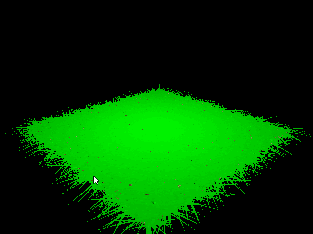
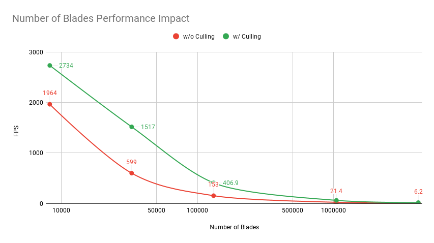
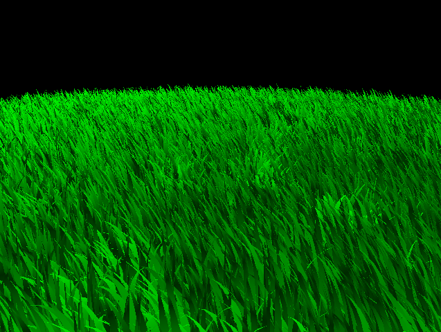
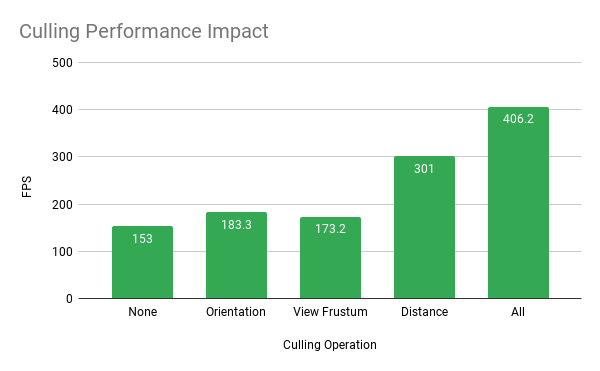

Vulkan Grass Rendering
==================================

**University of Pennsylvania, CIS 565: GPU Programming and Architecture, Project 5**

* Wayne Wu
  * [LinkedIn](https://www.linkedin.com/in/wayne-wu/), [Personal Website](https://www.wuwayne.com/)
* Tested on: Windows 10, AMD Ryzen 5 5600X @ 3.70GHz 32GB, RTX 3070 8GB (personal)

## Background

This project implements the simulation and rendering of grass in real-time using Vulkan based on the paper: [Responsive Real-Time Rendering for General 3D Scenes](https://www.cg.tuwien.ac.at/research/publications/2017/JAHRMANN-2017-RRTG/JAHRMANN-2017-RRTG-draft.pdf).


The three main components of the project are the following:
1. **Simulation**: Apply forces to the grass to provide dynamics.
2. **Culling**: Removing visually unimportant grass blades to improve performance.
3. **Rendering**: Tessellation and shading of the grass.

## Simulation
Three types of natural forces are simulated per blade as part of the physical model.
The simulation is performed in the compute shader.

### Gravity
Gravity is the first type of force applied. In addition to the normal downward gravity force, an artificial gravity force is also added that pushes the blade towards the face-forward direction in order to get the bending affect. However, since gravity is the only force applied at the moment, all the blades will just fall to the ground as shown below.

 

### Recovery
Once the recovery force is applied, which in essence models the grass blades as mass-spring systems, the blades will be kept from falling to the ground. This produces a more realistic grass-look as below:

 

### Wind
The wind force can be arbitrarily generated to add liveliness to the grass. The image is based on the following function:

```wind = windStrength * sin(totalTime) * vec3(1,0,1) * noise(v0)```

Adding all the forces together, we get the final result below:


## Culling
To reduce the number of blades that need to be rendered, three culling operations are performed in the compute shader.

### Orientation
Orientation culling removes blades that have a width direction parallel to the view direction. In the image below, we can see that as the camera is oriented, some blades disappear at a specific viewing angle. (Try focusing on one specific blade to see the effect).


### View-Frustum
View-frustum culling removes blades that are outside of the view frustum. Different from the paper, instead of adding a small tolerance value, a weight factor is used instead to shrink or expand the clip space. For example, the image below has a weight factor of `0.8`. Additionally, no bound-test is performed for the z component in clip space. 


### Distance
Finally, the distance culling operation removes blades based on the distance of the blade from the camera (projected on to the ground plane). The blade distance is discretized into a distance level bucket, in which a certain percentage of blades will be culled. The further the distance level is from the camera, the more blades will be culled.


## Rendering
The grass is rendered using its own graphics pipeline in Vulkan, on top of the pipeline that renders the ground with texture. Each blade data is processed as a vertex by the Vertex Shader, and the data (e.g. v0, v1 etc.) is passed directly from the Tessellation Control Shader to the Tessellation Evaluation Shader, in which the actual curve interpolation is performed. The tessellation level is set to 10 arbitrarily for sufficient visual quality. Finally, a simple shading model is applied in the Fragment Shader for ambient and diffuse lighting effects.

## Performance Analysis

### Number of Blades
The implementation was tested at different number of blades with and without culling operations. As expected, we see that as the number of blades increases (by a factor of 2), the FPS decreases accordingly. 
The maximum number of blades tested was 2e24 with culling operations and 2e20 without culling operations. Any number above those will produce unstable results.



### Effects of Culling
To understand the effect of each culling operation, each operation is applied exclusively for performance measurement.
It is important to note that the result is dependent on the camera view and the parameters applied. For example, a camera view that puts everything inside the view-frustum will not benefit from the view-frustum culling. In this particular scene, the distance culling has the greatest performance boost.

Test Scene                 |  Result
:-------------------------:|:-------------------------:
      | 