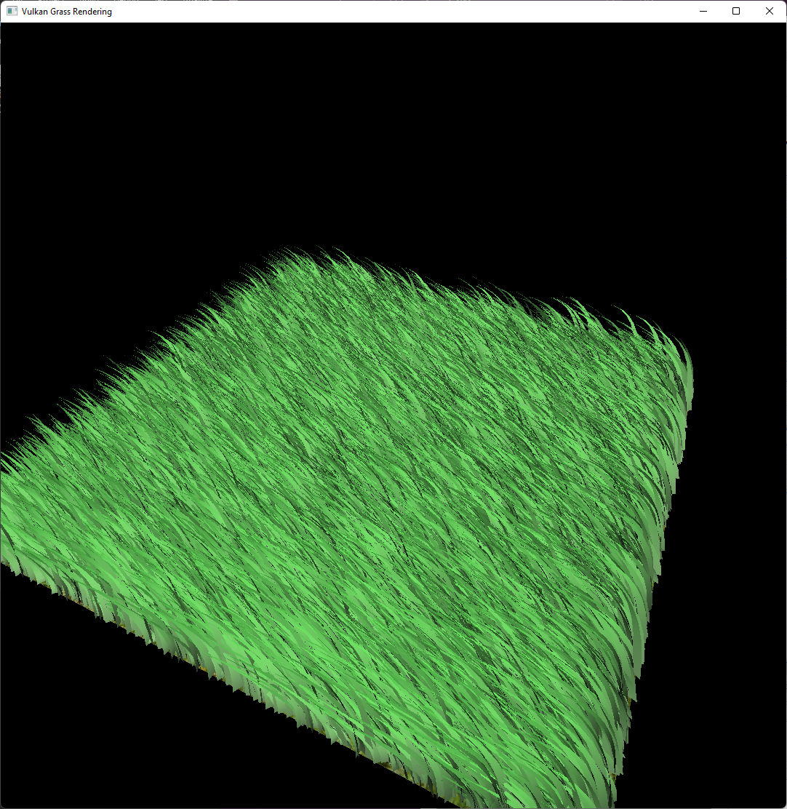

Vulkan Grass Rendering
==================================

**University of Pennsylvania, CIS 565: GPU Programming and Architecture, Project 5**

* Richard Chen
* Tested on: Windows 11, i7-10875H @ 2.3GHz 16GB, RTX 2060 MAX-Q 6GB (PC)

## Overview

Unlike the ubiquitous OpenGL, Vulkan is a low level graphics API that gives much
more control to the programmer (at the cost of being incredibly verbose). 
This comes with the added benefit of having a much higher performance ceiling
and low level graphics APIs like Vulkan, Metal, and DirectX 12 being used by 
game engines and where performance is needed.

In this project, we implemented a grass simulation based on "Responsive 
Real-Time Grass Rendering for General 3D Scenes" by Jahrmann and Wimmer in 
Vulkan. We used compute shaders to do physics calculations like wind, gravity, 
and restoring force. Additionally, tessellation shaders were added to the usual 
graphics pipeline of vertex and fragment shaders, where fixed function dedicated
hardware allows for fast and efficient tessellation of scenes.

## Features

### Grass
The blades of grass were modelled as Bezier curves. Each blade had v0, v1, and v2 
as the control points and an up vector, and orientation, height, width, and 
stiffness as scalar parameters. All of the parameters fit nicely into 4 vec4s.   

### Physics
As an approximation, the forces of gravity, wind, and a restoring force were
scaled by the time step and applied to the tip of the grass blade. Then, 
corrections were added to 
ensure the resulting position was valid, 
calculate v1 from v2, 
and maintain that grass blade lengths were invariant.

### Optimizations

* Orientation Culling: Grass blades can be approximated as a 2D plane so they
are not rendered when viewed edge-on 

* Distance Culling: When farther away, less grass is rendered until none are 
rendered at all

* View Frustrum Culling: Blades that the outside the camera's field of view are
not rendered as there is no point to doing computations on objects that will 
not be seen

### Other
* Lambertian Shading, where the color intensity is scaled by how directly the 
surface faces the camera

Lambert | Flat
--------|------
 | 
